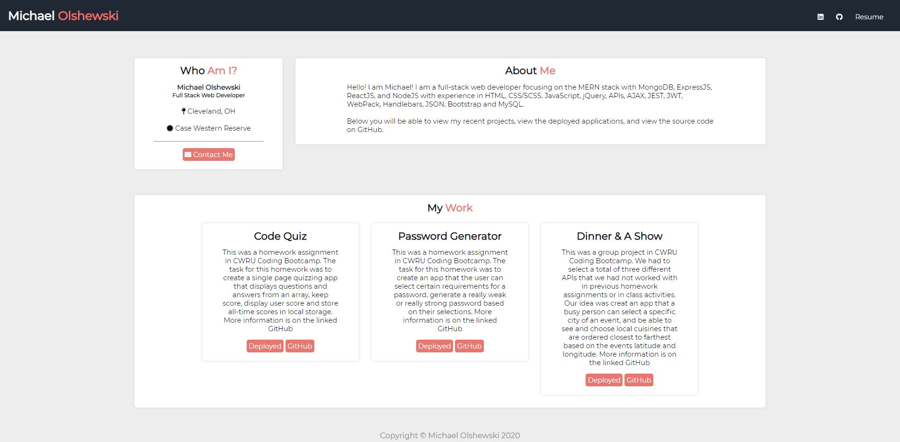

# __*Michael Olshewski's Responsive Portfolio*__

## __Details About This Assignment__
This is our online portfolio of projects and exemplary homework assignments that we have completed during the course of the coding bootcamp. I redesigned my site using SCSS with the mobile-first mindset. I made most of my own elements with the use of SCSS and used the bootstrap grid system to simplify my project list.

### __Link to Live Portfolio__
https://michaelolshewski.github.io/CWResponsivePortfolio

### __Image of 'index.html'__

